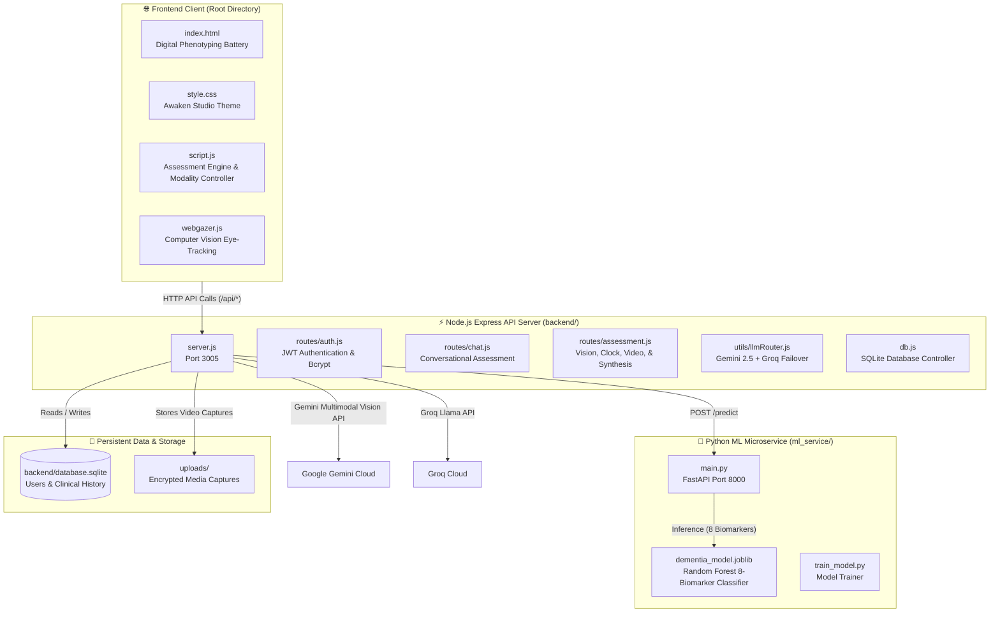

# COGNYX — Clinical-Grade Cognitive Passport & Digital Phenotyping Engine

> **Precision Digital Phenotyping, Cognitive Health Screening & Multi-Modal Diagnostic AI**

---

## 🏛️ System Architecture & Connected Folders

The COGNYX platform connects **Frontend**, **Express Backend**, **Python ML Microservice**, **SQLite Database**, and **Media Storage** into a unified, high-performance ecosystem.



---

## 📁 Directory Structure & Folder Connections

| Folder / File | Role | Connected To |
|---|---|---|
| **`/` (Root)** | Frontend static assets (`index.html`, `style.css`, `script.js`, `webgazer.js`) and Monorepo root package. | Served directly by Express backend (`http://localhost:3005/`) or any local server (e.g. Live Server). |
| **`backend/`** | Core Node.js / Express server, REST API endpoints, JWT auth, database access, Gemini multimodal vision, and LLM router. | Connects to SQLite DB (`backend/database.sqlite`), frontend (`/`), and proxies ML predictions to `ml_service/`. |
| **`ml_service/`** | Python FastAPI microservice hosting the Scikit-Learn Random Forest diagnostic model. | Listens on port `8000`, receives 8 biomarker vectors from `backend/server.js`, and outputs clinical risk predictions and confidence. |
| **`uploads/`** | Ephemeral storage for user-recorded assessment video and audio for multimodal behavioral analysis. | Managed by `backend/routes/assessment.js` (Multer) with automated cleanup. |

---

## 🚀 Quick Start & Launching All Services

### Option 1: 1-Click Windows Launcher (Recommended)
Double-click `start_all.bat` or run:
```cmd
start_all.bat
```
*This automatically launches the ML Microservice (port 8000), starts the Express backend (port 3005), and opens your browser at `http://localhost:3005`.*

### Option 2: PowerShell Launcher (Windows)
```powershell
.\start_all.ps1
```

### Option 3: Cross-Platform Python Launcher (Windows / macOS / Linux)
```bash
python run.py
```

### Option 4: Unified NPM Dev Script
```bash
npm run dev
```

---

## 🛠️ Installation & Setup

### 1. Install All Dependencies (Root + Backend + ML Service)
```bash
npm run install:all
```
*Or manually:*
```bash
# Root & Concurrently
npm install

# Express Backend
cd backend && npm install && cd ..

# Python ML Microservice
pip install -r ml_service/requirements.txt
```

### 2. Environment Configuration (`backend/.env`)
Create or edit `backend/.env`:
```env
PORT=3005
JWT_SECRET=your_secret_jwt_key_here
GEMINI_API_KEY=your_gemini_api_key
GROQ_API_KEY=your_groq_api_key
GEMINI_MODEL=gemini-2.5-flash
ML_SERVICE_URL=http://localhost:8000
```

---

## 🧪 Comprehensive Battery Phases

1. **Clinical Authentication**: JWT-secured login and sign-up with bcrypt password hashing.
2. **Modality Selection**: Text, Voice, or Continuous Multi-Modal Video with Eye-Tracking Telemetry.
3. **Conversational Assessment**: Clinical intake dialogue powered by Gemini 2.5 Flash / Groq LLM failover.
4. **Memory Registration**: 3-word memory encoding.
5. **Immediate Recall**: Working memory retention evaluation.
6. **Word Identification**: High-speed verbal/semantic recognition.
7. **Pattern Matching**: Visuospatial reasoning test.
8. **Reaction Time Battery**: 5-trial sub-millisecond reflex testing with median calculation.
9. **Clock Drawing Test**: HTML5 Canvas clock construction evaluated by Gemini 2.5 Multimodal Vision.
10. **Face & Voice Behavioral Phenotyping**: Multi-modal video analysis extracting Oculomotor, Affect, Kinematics, and Speech biomarkers.
11. **Delayed Recall**: Long-term memory retrieval verification.
12. **Machine Learning Risk Engine**: 8-biomarker Random Forest prediction (Healthy, MCI, Severe Impairment).
13. **Official Clinical Passport**: Structured diagnostic narrative + High-Resolution PDF Export.

---

## 📡 API Reference & Inter-Folder Routes

### Backend Server (`http://localhost:3005`)
- `GET /api/health` — Backend health & connectivity status
- `POST /api/signup` — Register new subject credentials
- `POST /api/login` — Authenticate and receive JWT session token
- `POST /api/chat` — Conversational intake step with LLM router
- `POST /api/chat/reset` — Reset active conversational session
- `POST /api/analyze-video` — Analyze video stream for behavioral biomarkers
- `POST /api/analyze-clock` — Gemini vision scoring of clock canvas drawing
- `POST /api/analyze-behavior` — Analyze eye-tracking gaze telemetry
- `POST /api/generate-final-report` — Generate clinical Markdown narrative
- `POST /api/save-report` — Persist assessment results to SQLite database
- `GET /api/history` — Fetch user assessment history archive
- `POST /api/predict` — Proxied ML prediction via ML microservice

### ML Microservice (`http://localhost:8000`)
- `GET /health` — Microservice health and model readiness
- `POST /predict` — Random forest classification for 8-feature biomarker vector

---

## 👨‍⚕️ Official Disclaimer
*The COGNYX Digital Phenotyping Passport is designed for cognitive wellness screening and investigational digital phenotyping. It is not an FDA-cleared diagnostic device for clinical dementia or neurological disorders.*
